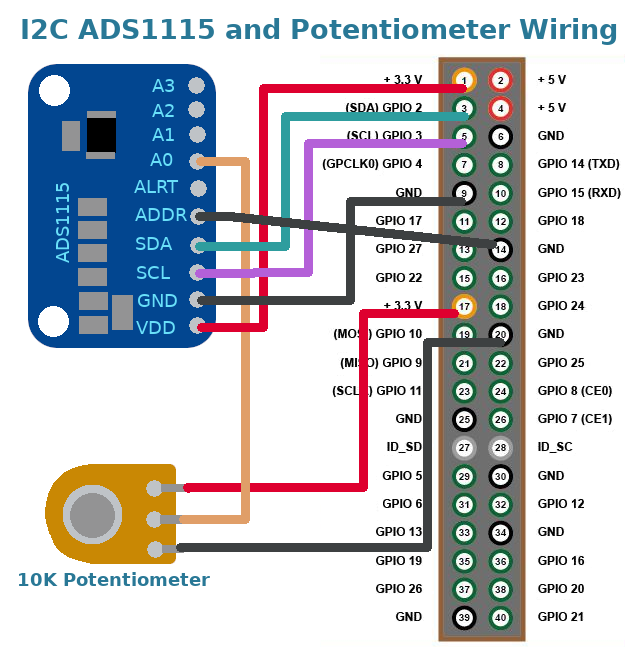

# Turn and Run

**This software should be considered alpha quality. It works fine for
me, but has not been used by other people. Please report any issues.**

## A radio station selector dial

The turnandrun program was written to provide a manual interface
to an internet radio player running on a Raspberry Pi. It manages
a single dial that is turned to marked positions to select stations to
play, or to stop the audio.

[](https://www.youtube.com/watch?v=LjFp83IrOW4)

These instructions describe a 10k potentiometer connected to an ADS1115
or ADS1015 ADC, and installation on Moode (or Raspberry Pi OS). However,
it should be possible to adapt them to another input device, or another
ADC, or another operating system.

A simple configuration file specifies commands to be run at certain
positions of the dial. These commands can be anything.

## Install the hardware

### Connect the hardware
The software should work with ADS1115 and ADS1015 modules. I have an
ADS1115 module and 10k potentiometer, wired like the following diagram
(in fact, I have a cheap fake ADS1115 module, that is really an ADS1015,
and counts in steps of 16, but is fine for use with turnandrun)



Note: the wiring diagram connects ADDR to GND, which onfigures the board to
use default I2C address 0x48.

### Configure the system

Enable the kernel driver for the first channel of the ADS1X15 board.
Edit the boot configuration file (on Volumio use
`sudo nano /boot/userconfig.txt`)
```
sudo nano /boot/config.txt
```
For an ADS1115, add the line
```
dtoverlay=ads1115,cha_enable,cha_gain=1
```
For an ADS1015, add the line
```
dtoverlay=ads1015,cha_enable,cha_gain=1
```

Ensure the I2C module is loaded at boot. Edit the modules file
```
sudo nano /etc/modules
```
Add the following line, if it is not already included
```
i2c-dev
```

Reboot to activate these changes
```
sudo reboot
```


## Install turnandrun

Choose one of the two instrallation methods.

### Install binary package (debian-based systems only)

This is the recommended installation method for debian-based systems,
for example Raspberry Pi OS, Moode and Volumio.

The following commands will download and install the most recent turnandrun
binary package (may not be completely up to date with the repository)
```
wget -N http://pitastic.com/mpd_oled/packages/mpd_oled_moode_install_latest.sh
sudo bash mpd_oled_moode_install_latest.sh
```

### Build and install from Source

This is the installation method for non-debian based systems (for
example RuneAudio, rAudio-1, and Arch Linux), or for using the
repository version if the package is no up to date, of simply if
building from source is preferred.

Install the packages needed, according to your system. On debian-based
systems the commands are
```
sudo apt update
sudo apt install build-essential autoconf libtool libiio-dev i2c-tools
```

Download, build and install turnandrun
```
git clone https://github.com/antiprism/turnandrun
cd turnandrun
./bootstrap
CPPFLAGS="-W -Wall -Wno-psabi" ./configure
make
sudo make install-strip
```

## Configure the program

The program is configured using a simple text file. The default
configuration file is `/etc/turnandrun.conf` (or specify a different
file, e.g. for testing, with `turnandrun -c path_to_conf_file`).

Edit the defaul configuration file and add your settings
```
sudo nano /etc/turnandrun.conf
```

### Configure dial commands

Use marks around the dial as positions where you would like commands
to be executed. These positions correspond to a raw dial dial reading,
which can be associated with a command to run in a confguration file.

To see the raw readings, us the dry run option
```
turnandrun -d
```
Make a record of the raw values corresponding to marks where you
want to run commands.

Each command is added to the configuration file as a single line in
the form `raw_reading=comand_label,command`, where `raw_reading` is the
raw number, `command_label` is short label to identify the command
(cannot include a comma), and `command` is the text of
the command to run. En example command line might be
```
24000 = stop, mpc stop
```

### Configure other settings

These settings only need to be included in the configuration file to
change the default value. The settings are added one on each line in
the form `setting=value`.

**channel = letter** (default: a, valid: a, b, c, d):
This is the channel on the ADS1X115 board that the potentiometer is
conected to. Channel 'a' is the first channel, perhaps marked 'A0'
on the board, and enabled in config.txt with 'cha_enable,cha_gain=1'.
Channel 'b' is the second channel, perhaps marked 'A1'
on the board, and enabled in config.txt with 'chb_enable,chb_gain=1'.
Likewise for channel values 'c' and 'd'.

**turn_before_run = bool** (default: 1, valid: 0, 1):
Specifies if the command corresponding to the current dial position
should be run on startup - '0' run the command, '1' wait for the dial
to change position before running any command. Don't
change from the default unless you are happy for any of the commands
to be run when the machine is started up, for example, when it is plugged
it in, or when it starts up after a power cut in the night.

**command_delay = seconds** (default: 1, range: 0 - 10):
Number of seconds for the dial to be at a mark before running the
command. The delay stops commands from being executed when the dial
is turned through one mark to get to another.

**frequency = per_second** (default: 10 range: 1 - 100)
Number of times per second to read the dial position.

**dead_zone_width = percent** (default: 5, range: 0 - 50)
Half-way between two adjacent dial marks is a dead zone, which is not
associated with any mark. The setting is the percentage of the width
between the two marks that should be used as the dead zone. The dead
zone eans that marks are clearly differentiated, and the dial cannot
inintentionally wander between marks when it is close to the mid-point.

Example configuration lines
```
turn_before_run = 1
dead_zone = 5
command_delay = 1
channel = a  
frequency = 10
```

### Example configuration file

This is my radio player configuration. I use defaults for the settings
(but specify the channel for the example), and specify commands for
four dial positions. The first dial position stops the audio, and the
other three positions play BBC Radio 1, 2 and 4.
```
channel = a  
0 = stop, mpc -q stop
8000 = BBC Radio 1, mpc -q clear && mpc -q add http://stream.live.vc.bbcmedia.co.uk/bbc_radio_one && mpc -q play
16000 = BBC Radio 2, mpc -q clear && mpc -q add http://stream.live.vc.bbcmedia.co.uk/bbc_radio_two && mpc -q play
24000 = BBC Radio 4, mpc -q clear && mpc -q add http://stream.live.vc.bbcmedia.co.uk/bbc_radio_fourfm && mpc -q play

```

### Testing the configuration

Run the program with option `-d` for a dry run.
```
turnandrun -d
```
This will produce a report on the screen of: the configuration options,
the current dial value and mark it corresponds to, and each time a command
would be run.

### Installing the service

After installing the service the turnandrun program will run
when the machine starts. Install the service with
```
sudo turnandrun_service_install
```
(and if you later want to uninstall the servicew run
`sudo turnandrun_service_uninstall`)


## Program Help and Options

The following text is printed by running `turnandrun -h`

```
Usage: turnandrun [options]

A 10k potentiometer is connected to an ADS1115 or ADS1015 ADC and a
simple configuration file determines commands to run at certain
positions.

Options
  -h,--help this help message
  --version version information

  -c <file>  configuration file name (default: /etc/turnandrun.conf), may
             contain the following lines (with two or more command lines)

               dial_reading_number = command_label, command_to_run

               channel = letter             (default: a, valid: a, b, c, d)
               turn_before_run = bool       (default: 1, valid: 0, 1)
               command_delay = seconds      (default: 1, range: 0 - 10)
               frequency = per_second       (default: 10 range: 1 - 100)
               dead_zone = percent_band    (default: 5, range: 0 - 50)
  -d         dry run, no commands are run, print a report to the screen of
             the configuration options, the current dial value and mark it
             corresponds to, and each time a command would be run.

```

